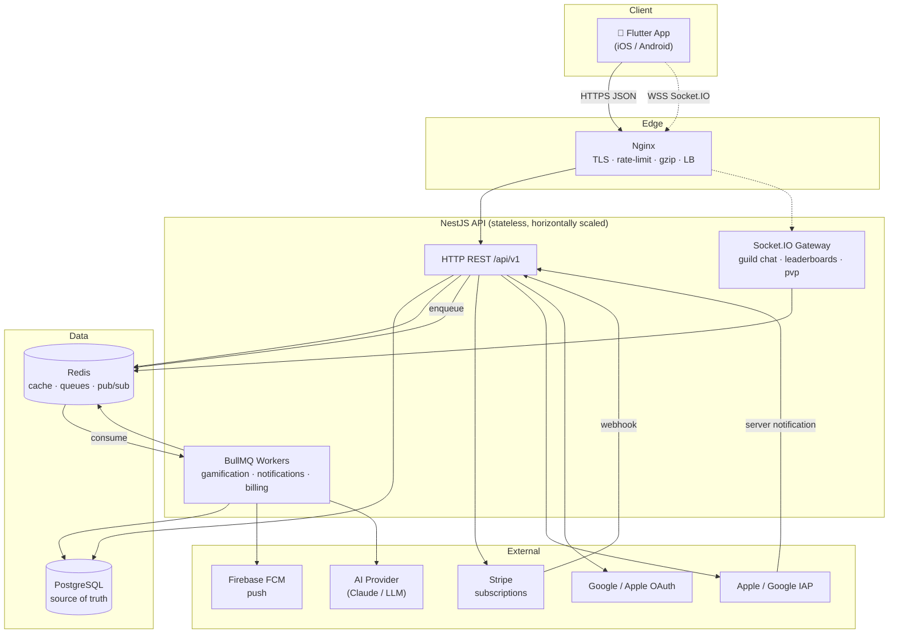
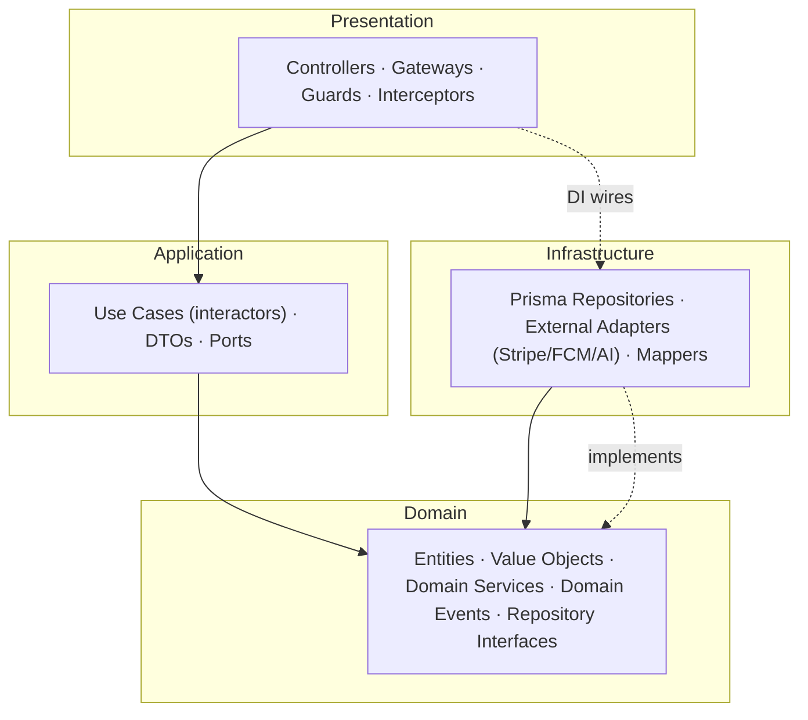
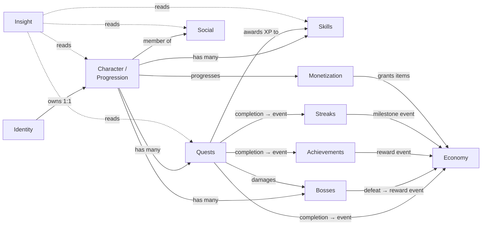
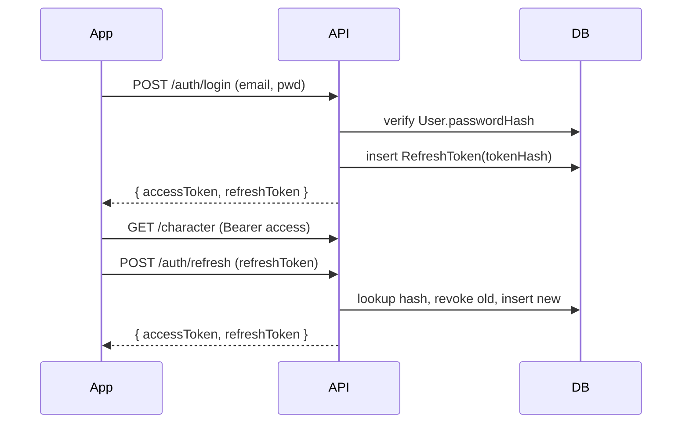
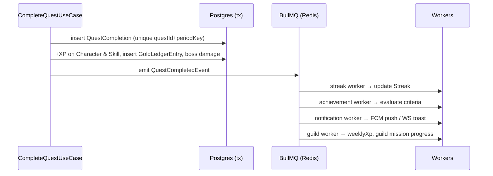

# Life Quest — Architecture

> System design, Clean Architecture layering, DDD bounded contexts, cross-cutting
> concerns, technology decisions, and non-functional requirements.
>
> This document is anchored to the canonical persistence model in
> [`backend/prisma/schema.prisma`](../backend/prisma/schema.prisma). Where this
> document and the schema disagree, **the schema wins** — please open a PR to fix
> the doc.

---

## 1. System Context

Life Quest is a cross-platform (iOS/Android) RPG-style self-improvement product.
A Flutter client talks to a NestJS API behind an Nginx gateway. State lives in
PostgreSQL (source of truth) and Redis (cache, queues, pub/sub). A set of
external providers handle auth, payments, push, and AI.



**Boundaries & responsibilities**

| Actor | Responsibility |
|-------|----------------|
| Flutter app | Presentation, local cache (Hive), optimistic UI, WSS session |
| Nginx | TLS termination, HTTP/2, gzip, IP rate limiting, load balancing, static assets |
| NestJS REST | Synchronous request/response, transactional writes, read models |
| Socket.IO gateway | Realtime fan-out: guild chat, live leaderboards, PvP score, XP/level-up toasts |
| BullMQ workers | Asynchronous side-effects: XP roll-ups, achievement evaluation, streak checks, push, billing reconciliation |
| PostgreSQL | Durable source of truth (see schema) |
| Redis | Response cache, leaderboard sorted sets, job queues, Socket.IO adapter pub/sub |
| Stripe / IAP | Payment authorization and lifecycle webhooks |
| Firebase FCM | Device push delivery |
| Google/Apple OAuth | Federated identity |
| AI provider | Coaching insights, quest generation, predictions |

---

## 2. Clean Architecture in the NestJS Backend

The backend follows **Clean Architecture** (a.k.a. Hexagonal / Ports & Adapters)
combined with **DDD** tactical patterns. Every bounded context is a NestJS module
with four internal layers.



### The Dependency Rule

Source-code dependencies point **inward only**. The **domain** layer depends on
nothing. The **application** layer depends only on the domain. The
**infrastructure** and **presentation** layers depend on application + domain but
are never depended upon.

- Domain defines **repository interfaces** (ports) such as `QuestRepository`.
- Infrastructure provides **implementations** (adapters) such as
  `PrismaQuestRepository`.
- NestJS DI binds the interface token to the concrete class at module wiring time,
  so use cases stay ignorant of Prisma, HTTP, Stripe, or Redis.

**Layer responsibilities**

| Layer | Contains | May depend on | Must NOT depend on |
|-------|----------|---------------|--------------------|
| Domain | Entities, value objects, domain services, domain events, repo interfaces, invariants | (nothing) | Nest, Prisma, HTTP |
| Application | Use cases, input/output DTOs, port interfaces, orchestration & transactions | Domain | Prisma, HTTP, Stripe |
| Infrastructure | Prisma repositories, adapters, mappers, queue producers/consumers | Application, Domain | Presentation |
| Presentation | Controllers, Socket.IO gateways, guards, pipes, interceptors, filters | Application (via use cases) | Infrastructure internals |

> Practical note: entities are **plain TypeScript** (no Prisma types). Mappers in
> the infrastructure layer translate between Prisma rows and domain entities so a
> future storage change never leaks into the domain.

---

## 3. DDD Bounded Contexts

Each context owns a slice of the schema. Modules are the deployment unit of a
context; they publish and subscribe to **domain events** for cross-context
choreography (never direct table writes across contexts).

| Bounded Context | Owns (Prisma models) | Core responsibility |
|-----------------|----------------------|---------------------|
| **Identity** | `User`, `RefreshToken`, `NotificationToken`, `AuditLog` | Auth, sessions, device tokens, audit trail |
| **Character / Progression** | `Character` | Level/XP curve, gold, HP, energy, active title/avatar |
| **Quests** | `Quest`, `QuestCompletion` | Task lifecycle, cadence, idempotent completion, rewards |
| **Skills** | `Skill`, `SkillXpEvent` | Per-skill leveling and XP history |
| **Bosses** | `Boss` (+ `Quest.bossId` link) | Big goals as HP bars, damage, defeat rewards |
| **Achievements** | `Achievement`, `CharacterAchievement` | Rule-based unlocks, tiered progress |
| **Economy** | `InventoryItem`, `ShopReward`, `GoldLedgerEntry` | Inventory, user-defined shop, append-only gold ledger |
| **Streaks** | `Streak` | Daily streak counting, freezes, milestones |
| **Social** | `Guild`, `GuildMember`, `GuildMission`, `GuildMessage`, `PvpChallenge` | Guilds, chat, shared missions, PvP duels |
| **Monetization** | `Season`, `BattlePassTier`, `BattlePassProgress`, `Subscription` | Battle pass, premium subscription, billing |
| **Insight** | (read models over all contexts) | Stats dashboards, AI coach, smart notifications |

### Context Map



**Relationship kinds (DDD context mapping)**

- **Character/Progression** is the **shared kernel hub**: nearly every context
  references `characterId`.
- **Quests → Economy/Skills/Streaks/Achievements** is **event choreography**:
  completing a quest emits `QuestCompletedEvent`, and downstream contexts react
  (award gold via the ledger, add skill XP, bump the streak, evaluate achievement
  criteria).
- **Economy** is a **conformist consumer** of reward events; it is the single
  writer of `GoldLedgerEntry` (append-only).
- **Insight** is a **read-only, anti-corruption** context: it never writes domain
  tables; it projects read models and calls the AI provider.

---

## 4. Repository Pattern

The domain declares a **port** (interface); infrastructure supplies a Prisma
**adapter**. Use cases depend on the port token only.

**Domain port** (`modules/quests/domain/ports/quest.repository.ts`):

```typescript
import { Quest } from '../entities/quest.entity';
import { QuestStatus, QuestCadence } from '../value-objects';

export interface QuestFilter {
  characterId: string;
  status?: QuestStatus;
  cadence?: QuestCadence;
}

export interface QuestRepository {
  findById(id: string): Promise<Quest | null>;
  findMany(filter: QuestFilter): Promise<Quest[]>;
  save(quest: Quest): Promise<void>;            // insert or update (upsert on id)
  delete(id: string): Promise<void>;
}

// DI token — controllers/use cases never import the concrete class.
export const QUEST_REPOSITORY = Symbol('QUEST_REPOSITORY');
```

**Infrastructure adapter**
(`modules/quests/infrastructure/persistence/prisma-quest.repository.ts`):

```typescript
import { Injectable } from '@nestjs/common';
import { PrismaService } from '../../../../common/prisma/prisma.service';
import { QuestRepository, QuestFilter } from '../../domain/ports/quest.repository';
import { Quest } from '../../domain/entities/quest.entity';
import { QuestMapper } from './quest.mapper';

@Injectable()
export class PrismaQuestRepository implements QuestRepository {
  constructor(private readonly prisma: PrismaService) {}

  async findById(id: string): Promise<Quest | null> {
    const row = await this.prisma.quest.findUnique({ where: { id } });
    return row ? QuestMapper.toDomain(row) : null;
  }

  async findMany(filter: QuestFilter): Promise<Quest[]> {
    const rows = await this.prisma.quest.findMany({
      where: {
        characterId: filter.characterId,
        status: filter.status,
        cadence: filter.cadence,
      },
      orderBy: { createdAt: 'desc' },
    });
    return rows.map(QuestMapper.toDomain);
  }

  async save(quest: Quest): Promise<void> {
    const data = QuestMapper.toPersistence(quest);
    await this.prisma.quest.upsert({
      where: { id: data.id },
      create: data,
      update: data,
    });
  }

  async delete(id: string): Promise<void> {
    await this.prisma.quest.delete({ where: { id } });
  }
}
```

**Wiring** (`modules/quests/quests.module.ts`):

```typescript
providers: [
  CompleteQuestUseCase,
  { provide: QUEST_REPOSITORY, useClass: PrismaQuestRepository },
]
```

Every context follows the same shape:
`CharacterRepository`, `SkillRepository`, `BossRepository`,
`AchievementRepository`, `GoldLedgerRepository`, `GuildRepository`, etc.

---

## 5. Cross-Cutting Concerns

### 5.1 Authentication — JWT access + refresh

- **Access token** (JWT, ~15 min): short-lived, stateless, carries
  `sub` (userId), `characterId`, `roles`, `tier`. Verified by a `JwtAuthGuard`.
- **Refresh token** (~30 days): opaque random string; **only its hash** is stored
  in `RefreshToken.tokenHash` (`@unique`). Rotation-on-use: each refresh revokes
  the old row (`revokedAt`) and issues a new one, enabling reuse detection.
- OAuth (`GOOGLE`, `APPLE`) verifies the provider ID token, then upserts a `User`
  by `(provider, providerId)` (unique in schema) and mints the same token pair.
- Device push tokens live in `NotificationToken` (`fcmToken` unique, `platform`).



### 5.2 Authorization — RBAC

- **Platform roles**: `USER`, `ADMIN` (admin used for `ADMIN_ADJUSTMENT` gold
  entries, achievement catalog, seasons). Enforced by a `RolesGuard` + `@Roles()`
  decorator reading token claims.
- **Guild roles**: `LEADER`, `OFFICER`, `MEMBER` (`GuildMember.role`). Domain-level
  guards (e.g. only `LEADER`/`OFFICER` create missions or kick members).
- **Ownership**: resources are scoped by `characterId`; a `ResourceOwnerGuard`
  rejects cross-character access (a user may only touch their own quests, skills,
  bosses, inventory, etc.).

### 5.3 Validation

- `class-validator` + `class-transformer` on request DTOs, enforced by a global
  `ValidationPipe` (`whitelist: true`, `forbidNonWhitelisted: true`).
- Domain invariants (e.g. `energyCost <= character.energy`, quest already completed
  for the period) are enforced inside entities/use cases, not just at the edge.

### 5.4 Error model

All errors are normalized by a global `HttpExceptionFilter` into a single envelope:

```json
{
  "statusCode": 409,
  "message": "Quest already completed for this period",
  "error": "Conflict",
  "timestamp": "2026-07-25T10:15:30.000Z",
  "path": "/api/v1/quests/ckq.../complete"
}
```

Domain errors map to HTTP codes (e.g. `QuestAlreadyCompletedError` → `409`,
`InsufficientEnergyError` → `422`, `InsufficientGoldError` → `422`).

### 5.5 Rate limiting

- Edge: Nginx per-IP `limit_req`.
- App: `@nestjs/throttler` (Redis store) — global default (e.g. 100 req/min/user),
  tighter buckets on auth (`/auth/login`, `/auth/refresh`) and AI endpoints.

### 5.6 Idempotency

- **Quest completion** is idempotent at the database level:
  `QuestCompletion @@unique([questId, periodKey])`. A retry with the same
  `periodKey` (e.g. `2026-07-25` daily, `2026-W30` weekly, `2026-07` monthly)
  hits the unique constraint and returns the existing completion instead of
  double-awarding.
- **Billing webhooks** and **mutating client requests** accept an
  `Idempotency-Key` header, deduplicated via a Redis `SETNX` guard.

### 5.7 Event-driven gamification

Writes emit **domain events**; a lightweight in-process event bus forwards them to
**BullMQ** queues so heavy side-effects run asynchronously and idempotently.



Queues: `gamification`, `achievements`, `streaks`, `notifications`, `billing`,
`leaderboards`, `ai`. Jobs are retried with backoff and are idempotent (keyed by
event id) so at-least-once delivery is safe.

### 5.8 WebSocket gateway (Socket.IO)

- Namespaces: `/guild`, `/leaderboard`, `/pvp`, `/character`.
- Rooms: `guild:{guildId}`, `pvp:{challengeId}`, `character:{characterId}`.
- Multi-instance fan-out via the **Redis Socket.IO adapter** (pub/sub).
- Auth: JWT passed in the Socket.IO handshake, validated by a `WsJwtGuard`.
- Used for guild chat (`GuildMessage`), live leaderboards, PvP score updates, and
  XP/level-up toasts.

### 5.9 Caching strategy (Redis)

| Data | Pattern | Invalidation |
|------|---------|--------------|
| Character/skill read models | Cache-aside, TTL 30–60 s | On write via event |
| Leaderboards (guild, PvP, global) | Redis **sorted sets** (`ZADD`/`ZREVRANGE`) | Incremental on XP events |
| Achievement catalog, season tiers | Long TTL (mostly static) | On admin update |
| Rate-limit + idempotency keys | Native Redis counters/`SETNX` | TTL |
| Session/refresh reuse detection | Hash lookups | On rotation |

### 5.10 Observability

- **Logs**: structured JSON (pino) with `requestId`/`traceId` correlation.
- **Metrics**: Prometheus (`/metrics`) — latency histograms, queue depth, DB pool,
  cache hit ratio; visualized in Grafana.
- **Tracing**: OpenTelemetry spans across HTTP → use case → repo → DB/queue.
- **Audit**: security-relevant mutations persisted to `AuditLog`.
- **Health**: `/api/v1/health` (liveness) and readiness probes for DB/Redis.

---

## 6. Technology Decisions

| Choice | Rationale | Alternatives considered |
|--------|-----------|-------------------------|
| **NestJS** | Opinionated DI + modules map cleanly to DDD contexts; first-class guards/pipes/interceptors for cross-cutting concerns | Express (too unstructured), Fastify-only, Spring Boot |
| **TypeScript** | Shared mental model with Flutter/Dart typing; strong domain modeling | Plain JS, Go, Kotlin |
| **PostgreSQL** | Relational integrity for a highly-relational RPG model; JSONB for flexible fields (`repeatRule`, `criteria`, rewards); strong constraints for idempotency | MySQL, MongoDB (weak cross-entity integrity) |
| **Prisma** | Type-safe client, migrations, matches the entity mapper pattern; single source of truth schema | TypeORM (heavier), Knex (no types), Drizzle |
| **Redis** | One system for cache + queues + pub/sub + leaderboards (sorted sets) | Memcached (cache only), RabbitMQ + separate cache |
| **BullMQ** | Redis-native, reliable retries/backoff, fits event-driven gamification | Kafka (operational overkill at this stage), SQS (cloud lock-in) |
| **Socket.IO** | Rooms/namespaces + Redis adapter make guild chat & live leaderboards trivial | Raw WebSocket, SSE (one-way only) |
| **JWT access + refresh** | Stateless scaling; refresh rotation + hashed storage for revocation | Server sessions (sticky state), opaque tokens only |
| **Stripe + native IAP** | Stripe for web/card; Apple/Google IAP required by store policy for digital goods | Stripe-only (store-rejected), Paddle |
| **Firebase FCM** | Unified iOS/Android push, mature SDK | APNs/Web-push direct (more plumbing) |
| **Flutter + Riverpod** | Single codebase, 60fps AAA UI; Riverpod for testable state; Freezed for immutability; Hive for offline | React Native, native duplication |
| **Nginx** | Battle-tested TLS/rate-limit/LB in front of stateless API | Traefik, cloud LB only |
| **Docker + Kubernetes** | Reproducible local + horizontal prod scaling | Bare VMs, serverless (WS/queues awkward) |

---

## 7. Non-Functional Requirements

### Scalability

- API and WS gateways are **stateless** and scale horizontally behind Nginx;
  Redis pub/sub carries cross-instance WS fan-out.
- Workers scale independently of the API by queue depth.
- Read-heavy paths (dashboards, leaderboards) served from Redis; Postgres read
  replicas available for Insight projections.
- `BigInt` totals (`Character.totalXp`, `Skill.totalXp`, `Guild.xp`) avoid overflow
  for lifetime aggregates.

### Security

- Passwords hashed with Argon2id; refresh tokens stored **hashed** only.
- TLS everywhere; HSTS; strict CORS allow-list.
- Global input validation + output serialization (no accidental field leakage).
- RBAC + ownership guards; least-privilege DB user.
- Secrets via env/secret manager; webhook signatures verified (Stripe, Apple/Google).
- Full audit trail (`AuditLog`); GDPR export/delete (see `DATABASE.md`).

### Performance targets

| Metric | Target |
|--------|--------|
| REST read p95 | < 150 ms (cache hit < 30 ms) |
| REST write p95 | < 300 ms |
| WS message delivery p95 | < 200 ms |
| Quest-complete → toast/push | < 2 s (async) |
| API availability | 99.9% |
| Cache hit ratio (hot reads) | > 85% |

---

## 8. Related Documents

- [DATABASE.md](DATABASE.md) — table-by-table persistence reference
- [ER_DIAGRAM.md](ER_DIAGRAM.md) — entity-relationship diagrams
- [API.md](API.md) — REST + WebSocket contract
- [FOLDER_STRUCTURE.md](FOLDER_STRUCTURE.md) — backend & mobile layout
