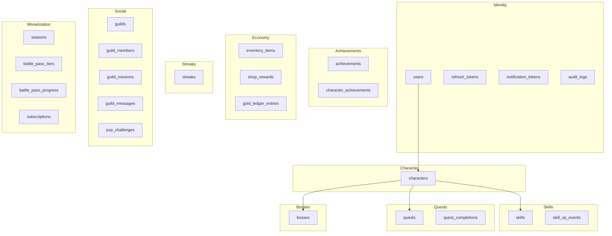
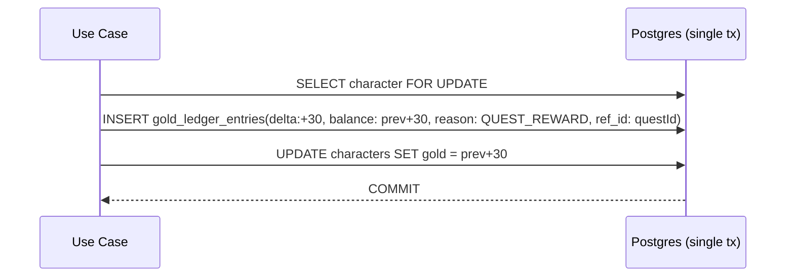

# Life Quest — Database Reference

> Persistence strategy and a table-by-table reference for every model in
> [`backend/prisma/schema.prisma`](../backend/prisma/schema.prisma).
>
> The Prisma schema is the **single source of truth**. This document describes the
> tables generated from it (snake_case via `@@map`, cuid ids, UTC timestamps).

---

## 1. Persistence Strategy

- **Engine**: PostgreSQL. Chosen for relational integrity across a highly
  interconnected RPG domain, rich indexing, and JSONB for flexible fields.
- **ORM**: Prisma with a type-safe client. Domain code never imports Prisma types
  directly — infrastructure mappers translate rows ↔ domain entities.
- **Migrations**: `prisma migrate` produces versioned SQL migrations checked into
  git; `prisma migrate deploy` runs them in CI/CD. The schema is authoritative and
  migrations are never hand-edited after being applied.
- **Conventions**:
  - Primary keys are `cuid()` strings unless a stable slug is meaningful
    (`Achievement.id`, `Season`/tier ids).
  - Table names are snake_case (`@@map`), columns snake_case (`@map`).
  - `createdAt`/`updatedAt` are UTC; `updatedAt` uses Prisma `@updatedAt`.
  - Money-like lifetime aggregates use `BigInt`; per-level XP and gold balances use
    `Int`.
  - Cascade deletes model ownership (`onDelete: Cascade` from `User` → `Character`
    → children); nullable references use `SetNull`.

### High-level grouping

---

## 2. Enums

Defined once in the schema and reused across tables:

| Enum | Values |
|------|--------|
| `AuthProvider` | `EMAIL`, `GOOGLE`, `APPLE` |
| `CharacterClass` | `WARRIOR`, `MAGE`, `ROGUE`, `RANGER`, `PALADIN` |
| `QuestCadence` | `DAILY`, `WEEKLY`, `MONTHLY`, `ONE_OFF` |
| `Difficulty` | `TRIVIAL`, `EASY`, `MEDIUM`, `HARD`, `EPIC` |
| `QuestStatus` | `ACTIVE`, `COMPLETED`, `ARCHIVED` |
| `CompletionSource` | `MANUAL`, `TIMER`, `INTEGRATION` |
| `Rarity` | `BRONZE`, `SILVER`, `GOLD`, `LEGENDARY` |
| `BossStatus` | `ACTIVE`, `DEFEATED`, `ABANDONED` |
| `ItemType` | `COSMETIC_AVATAR`, `COSMETIC_THEME`, `COSMETIC_FRAME`, `TITLE`, `REWARD_COUPON`, `CONSUMABLE_STREAK_FREEZE`, `CONSUMABLE_ENERGY_POTION` |
| `GuildRole` | `LEADER`, `OFFICER`, `MEMBER` |
| `PvpMetric` | `XP`, `QUESTS_COMPLETED`, `STUDY_MINUTES`, `WORKOUT_MINUTES`, `STEPS` |
| `PvpStatus` | `PENDING`, `ACTIVE`, `FINISHED`, `CANCELLED` |
| `SubscriptionTier` | `FREE`, `PREMIUM` |
| `SubscriptionStatus` | `ACTIVE`, `TRIALING`, `PAST_DUE`, `CANCELLED`, `EXPIRED` |
| `BillingProvider` | `STRIPE`, `APPLE_IAP`, `GOOGLE_PLAY` |
| `LedgerReason` | `QUEST_REWARD`, `BOSS_REWARD`, `ACHIEVEMENT_REWARD`, `STREAK_MILESTONE`, `BATTLE_PASS`, `SHOP_PURCHASE`, `ADMIN_ADJUSTMENT`, `PVP_REWARD` |

---

## 3. Table Reference

### 3.1 Identity Context

#### `users`
Root identity record. One user optionally owns one character.

| Column | Type | Notes |
|--------|------|-------|
| `id` | cuid PK | |
| `email` | String | `@unique` |
| `password_hash` | String? | null for pure OAuth users |
| `provider` | `AuthProvider` | default `EMAIL` |
| `provider_id` | String? | external subject for OAuth |
| `email_verified` | Boolean | default `false` |
| `is_active` | Boolean | default `true` (soft disable) |
| `last_login_at` | DateTime? | |
| `created_at` / `updated_at` | DateTime | |

- **Relations**: `character` (1:1), `refreshTokens` (1:N), `notificationTokens`
  (1:N), `subscription` (1:1), `auditLogs` (1:N).
- **Constraints/Indexes**: `@@unique([provider, providerId])` prevents duplicate
  federated identities; `email` unique.

#### `refresh_tokens`
Rotating refresh-token store; only the **hash** is persisted.

| Column | Type | Notes |
|--------|------|-------|
| `id` | cuid PK | |
| `user_id` | FK → users | `onDelete: Cascade` |
| `token_hash` | String | `@unique` |
| `user_agent`, `ip` | String? | session metadata for reuse detection |
| `expires_at` | DateTime | |
| `revoked_at` | DateTime? | set on rotation/logout |
| `created_at` | DateTime | |

- **Index**: `@@index([userId])`.

#### `notification_tokens`
FCM device tokens for push.

| Column | Type | Notes |
|--------|------|-------|
| `id` | cuid PK | |
| `user_id` | FK → users | Cascade |
| `fcm_token` | String | `@unique` |
| `platform` | String | `ios` \| `android` |
| `created_at` | DateTime | |

- **Index**: `@@index([userId])`.

#### `audit_logs`
Append-only security/audit trail.

| Column | Type | Notes |
|--------|------|-------|
| `id` | cuid PK | |
| `user_id` | FK? → users | `onDelete: SetNull` (retain log if user deleted) |
| `action` | String | e.g. `AUTH_LOGIN`, `GOLD_ADJUST` |
| `entity`, `entity_id` | String? | affected resource |
| `metadata` | Json? | contextual payload |
| `ip` | String? | |
| `created_at` | DateTime | |

- **Index**: `@@index([userId, createdAt])`.

---

### 3.2 Character / Progression Context

#### `characters`
The player avatar and progression state; the hub referenced by most contexts.

| Column | Type | Notes |
|--------|------|-------|
| `id` | cuid PK | |
| `user_id` | FK → users | `@unique` (1:1), Cascade |
| `name` | String | |
| `avatar_key` | String | default `default` |
| `class` | `CharacterClass` | default `RANGER` |
| `level` | Int | default 1 |
| `xp` | Int | XP **within** the current level |
| `total_xp` | **BigInt** | lifetime XP (overflow-safe) |
| `gold` | Int | current spendable balance |
| `hp` / `max_hp` | Int | default 100 |
| `energy` / `max_energy` | Int | default 100 (spent by quests) |
| `active_title` | String? | equipped title |
| `created_at` / `updated_at` | DateTime | |

- **Relations**: `skills`, `quests`, `questCompletions`, `bosses`, `achievements`,
  `inventory`, `shopRewards`, `streak` (1:1), `goldLedger`, `guildMembership` (1:1),
  `battlePass`.
- **Note**: `gold` is a cached balance; the authoritative history is
  `gold_ledger_entries` (see §4.2).

---

### 3.3 Skills Context

#### `skills`
Per-character skill tracks (programming, fitness, reading, english, business,
finance, leadership, discipline, …).

| Column | Type | Notes |
|--------|------|-------|
| `id` | cuid PK | |
| `character_id` | FK → characters | Cascade |
| `key` | String | stable skill key |
| `name` | String | display name |
| `icon` | String | default `bolt` |
| `color` | String | default `#7C5CFF` |
| `level` | Int | default 1 |
| `xp` | Int | within current level |
| `total_xp` | **BigInt** | lifetime |
| `created_at` / `updated_at` | DateTime | |

- **Constraints/Indexes**: `@@unique([characterId, key])` (one row per skill per
  character), `@@index([characterId])`.

#### `skill_xp_events`
Append-only XP history feeding heatmaps and skill charts.

| Column | Type | Notes |
|--------|------|-------|
| `id` | cuid PK | |
| `skill_id` | FK → skills | Cascade |
| `amount` | Int | XP granted |
| `source` | String | `questId` or `"manual"` |
| `created_at` | DateTime | |

- **Index**: `@@index([skillId, createdAt])` (time-series queries).

---

### 3.4 Quests Context

#### `quests`
User tasks/habits. Rewards are base values scaled by difficulty at completion.

| Column | Type | Notes |
|--------|------|-------|
| `id` | cuid PK | |
| `character_id` | FK → characters | Cascade |
| `title` | String | |
| `description` | String? | |
| `cadence` | `QuestCadence` | default `DAILY` |
| `difficulty` | `Difficulty` | default `MEDIUM` |
| `status` | `QuestStatus` | default `ACTIVE` |
| `xp_reward` | Int | default 20 |
| `gold_reward` | Int | default 10 |
| `skill_key` | String? | which skill receives XP |
| `energy_cost` | Int | default 10 |
| `repeat_rule` | Json? | `{ daysOfWeek:[1,3,5], dayOfMonth:1, ... }` |
| `due_at` | DateTime? | |
| `boss_id` | FK? → bosses | `onDelete: SetNull` |
| `damage` | Int | damage dealt to boss on completion, default 10 |
| `created_at` / `updated_at` | DateTime | |
| `archived_at` | DateTime? | soft-archive marker |

- **Relations**: `character`, `boss` (optional), `completions`.
- **Indexes**: `@@index([characterId, status])`, `@@index([characterId, cadence])`.

#### `quest_completions`
Idempotent record of a quest being completed in a given period.

| Column | Type | Notes |
|--------|------|-------|
| `id` | cuid PK | |
| `quest_id` | FK → quests | Cascade |
| `character_id` | FK → characters | Cascade |
| `completed_at` | DateTime | default now |
| `period_key` | String | `2026-07-25` (daily) / `2026-W30` (weekly) / `2026-07` (monthly) / one-off |
| `xp_awarded` | Int | actual XP granted (post-scaling) |
| `gold_awarded` | Int | actual gold granted |
| `source` | `CompletionSource` | default `MANUAL` |

- **Constraints/Indexes**: **`@@unique([questId, periodKey])`** — the idempotency
  guarantee (one completion per quest per period); `@@index([characterId, completedAt])`.

---

### 3.5 Bosses Context

#### `bosses`
Big goals rendered as HP bars; quests deal damage; rewards granted on defeat.

| Column | Type | Notes |
|--------|------|-------|
| `id` | cuid PK | |
| `character_id` | FK → characters | Cascade |
| `name` | String | |
| `description` | String? | |
| `image_key` | String | default `boss_default` |
| `max_hp` / `current_hp` | Int | |
| `status` | `BossStatus` | default `ACTIVE` |
| `reward_xp` | Int | default 500 |
| `reward_gold` | Int | default 250 |
| `reward_item_id` | String? | catalog item granted on defeat |
| `deadline` | DateTime? | |
| `created_at` / `defeated_at` | DateTime? | |

- **Relations**: `character`, `quests` (linked via `Quest.bossId`).
- **Index**: `@@index([characterId, status])`.

---

### 3.6 Achievements Context

#### `achievements`
Global catalog (seeded, admin-managed). PK is a **stable slug**.

| Column | Type | Notes |
|--------|------|-------|
| `id` | String PK | slug, e.g. `first_blood` |
| `name` | String | |
| `description` | String | |
| `rarity` | `Rarity` | |
| `icon` | String | |
| `category` | String | `quests`\|`skills`\|`streaks`\|`social`\|`economy`\|`meta` |
| `reward_xp` | Int | default 0 |
| `reward_gold` | Int | default 0 |
| `criteria` | Json | machine-readable unlock rule for the achievement engine |
| `is_secret` | Boolean | default false |

- **Relation**: `unlocks` (`CharacterAchievement`).

#### `character_achievements`
Per-character unlock/progress state.

| Column | Type | Notes |
|--------|------|-------|
| `id` | cuid PK | |
| `character_id` | FK → characters | Cascade |
| `achievement_id` | FK → achievements | Cascade |
| `progress` | Float | 0..1 for progressive achievements |
| `unlocked_at` | DateTime? | null until unlocked |
| `created_at` | DateTime | |

- **Constraints/Indexes**: `@@unique([characterId, achievementId])`,
  `@@index([characterId])`.

---

### 3.7 Economy Context

#### `inventory_items`
Owned cosmetics, titles, coupons, and consumables.

| Column | Type | Notes |
|--------|------|-------|
| `id` | cuid PK | |
| `character_id` | FK → characters | Cascade |
| `item_type` | `ItemType` | |
| `ref_key` | String | catalog key of the cosmetic/title/coupon |
| `name` | String | |
| `quantity` | Int | default 1 |
| `equipped` | Boolean | default false |
| `metadata` | Json? | |
| `acquired_at` | DateTime | |

- **Index**: `@@index([characterId, itemType])`.

#### `shop_rewards`
**User-defined** real-life rewards purchasable with gold.

| Column | Type | Notes |
|--------|------|-------|
| `id` | cuid PK | |
| `character_id` | FK → characters | Cascade |
| `title` | String | e.g. "1h gaming" |
| `description` | String? | |
| `icon` | String | default `gift` |
| `gold_cost` | Int | |
| `stock` | Int? | null = unlimited |
| `times_redeemed` | Int | default 0 |
| `is_active` | Boolean | default true |
| `created_at` | DateTime | |

- **Index**: `@@index([characterId, isActive])`.

#### `gold_ledger_entries`
**Append-only** double-entry-style gold history (see §4.2).

| Column | Type | Notes |
|--------|------|-------|
| `id` | cuid PK | |
| `character_id` | FK → characters | Cascade |
| `delta` | Int | `+earned` / `-spent` |
| `balance` | Int | running balance after this entry |
| `reason` | `LedgerReason` | |
| `ref_id` | String? | source entity (questId, bossId, shopRewardId, …) |
| `created_at` | DateTime | |

- **Index**: `@@index([characterId, createdAt])`.

---

### 3.8 Streaks Context

#### `streaks`
One streak record per character.

| Column | Type | Notes |
|--------|------|-------|
| `id` | cuid PK | |
| `character_id` | FK → characters | `@unique` (1:1), Cascade |
| `current` | Int | current streak length |
| `longest` | Int | best ever |
| `freeze_count` | Int | available streak freezes |
| `last_active_day` | String? | `YYYY-MM-DD` in user's timezone |
| `updated_at` | DateTime | |

---

### 3.9 Social Context

#### `guilds`
Player groups.

| Column | Type | Notes |
|--------|------|-------|
| `id` | cuid PK | |
| `name` | String | `@unique` |
| `tag` | String | `@unique`, 2–5 chars |
| `description` | String? | |
| `emblem_key` | String | default `emblem_default` |
| `xp` | **BigInt** | aggregate guild XP |
| `level` | Int | default 1 |
| `is_public` | Boolean | default true |
| `created_at` | DateTime | |

- **Relations**: `members`, `missions`, `messages`.

#### `guild_members`
Membership join (one guild per character).

| Column | Type | Notes |
|--------|------|-------|
| `id` | cuid PK | |
| `guild_id` | FK → guilds | Cascade |
| `character_id` | FK → characters | `@unique` (one guild per character), Cascade |
| `role` | `GuildRole` | default `MEMBER` |
| `weekly_xp` | Int | rolling weekly contribution |
| `joined_at` | DateTime | |

- **Index**: `@@index([guildId])`.

#### `guild_missions`
Shared guild goals.

| Column | Type | Notes |
|--------|------|-------|
| `id` | cuid PK | |
| `guild_id` | FK → guilds | Cascade |
| `title` | String | |
| `target_value` / `current_value` | Int | progress toward target |
| `metric` | `PvpMetric` | default `XP` |
| `reward_gold` | Int | default 0 |
| `expires_at` | DateTime | |
| `completed_at` | DateTime? | |
| `created_at` | DateTime | |

- **Index**: `@@index([guildId])`.

#### `guild_messages`
Guild chat log.

| Column | Type | Notes |
|--------|------|-------|
| `id` | cuid PK | |
| `guild_id` | FK → guilds | Cascade |
| `character_id` | String | author (character) |
| `body` | String | |
| `created_at` | DateTime | |

- **Index**: `@@index([guildId, createdAt])` (chat history paging).

#### `pvp_challenges`
1:1 duels between characters over a metric and time window.

| Column | Type | Notes |
|--------|------|-------|
| `id` | cuid PK | |
| `challenger_id` / `opponent_id` | String | character ids |
| `metric` | `PvpMetric` | |
| `status` | `PvpStatus` | default `PENDING` |
| `start_at` / `end_at` | DateTime | contest window |
| `challenger_score` / `opponent_score` | Int | default 0 |
| `winner_id` | String? | set on finish |
| `created_at` | DateTime | |

- **Indexes**: `@@index([challengerId, status])`, `@@index([opponentId, status])`.

---

### 3.10 Monetization Context

#### `seasons`
Battle-pass seasons.

| Column | Type | Notes |
|--------|------|-------|
| `id` | cuid PK | |
| `name` | String | |
| `start_at` / `end_at` | DateTime | |
| `is_active` | Boolean | default true |

- **Relations**: `tiers`, `progress`.

#### `battle_pass_tiers`
Reward ladder for a season.

| Column | Type | Notes |
|--------|------|-------|
| `id` | cuid PK | |
| `season_id` | FK → seasons | Cascade |
| `tier` | Int | ladder position |
| `xp_required` | Int | XP to reach this tier |
| `free_reward` | Json? | `{ type, refKey, amount }` |
| `premium_reward` | Json? | premium-track reward |

- **Constraint**: `@@unique([seasonId, tier])`.

#### `battle_pass_progress`
Per-character progress in a season.

| Column | Type | Notes |
|--------|------|-------|
| `id` | cuid PK | |
| `character_id` | FK → characters | Cascade |
| `season_id` | FK → seasons | Cascade |
| `xp` | Int | season XP |
| `tier` | Int | current tier |
| `is_premium` | Boolean | premium track unlocked |
| `claimed_tiers` | Int[] | claimed tier indices |
| `updated_at` | DateTime | |

- **Constraint**: `@@unique([characterId, seasonId])`.

#### `subscriptions`
Premium subscription state (1:1 with user).

| Column | Type | Notes |
|--------|------|-------|
| `id` | cuid PK | |
| `user_id` | FK → users | `@unique` (1:1), Cascade |
| `tier` | `SubscriptionTier` | default `FREE` |
| `status` | `SubscriptionStatus` | default `ACTIVE` |
| `provider` | `BillingProvider?` | `STRIPE` \| `APPLE_IAP` \| `GOOGLE_PLAY` |
| `external_id` | String? | Stripe sub id / IAP original transaction id |
| `current_period_end` | DateTime? | |
| `cancel_at_period_end` | Boolean | default false |
| `created_at` / `updated_at` | DateTime | |

---

## 4. Indexing & Performance Strategy

### 4.1 Indexing

- **Access-path indexes** mirror the app's hottest queries:
  - `quests(characterId, status)` and `quests(characterId, cadence)` — dashboard
    and cadence tabs.
  - `quest_completions(characterId, completedAt)` — activity feeds/heatmaps.
  - `skill_xp_events(skillId, createdAt)` — skill time-series.
  - `gold_ledger_entries(characterId, createdAt)` — economy history.
  - `guild_messages(guildId, createdAt)` — chat paging.
  - `pvp_challenges(challengerId, status)` / `(opponentId, status)` — active duels.
- **Uniqueness/idempotency indexes** double as constraints:
  `quest_completions(questId, periodKey)`, `skills(characterId, key)`,
  `character_achievements(characterId, achievementId)`,
  `battle_pass_tiers(seasonId, tier)`, `battle_pass_progress(characterId, seasonId)`,
  `users(provider, providerId)`, plus single-column uniques
  (`email`, `token_hash`, `fcm_token`, guild `name`/`tag`).
- Leaderboards are served from **Redis sorted sets**, not `ORDER BY` scans; Postgres
  remains the durable backstop.

### 4.2 Gold ledger — append-only pattern

`gold_ledger_entries` is **never updated or deleted**. Every gold change inserts a
new row carrying `delta` and the resulting `balance`. `Character.gold` is a cached
projection of the latest ledger balance and is written in the **same transaction**
as the ledger insert, so the two can never diverge. This gives:

- a complete, tamper-evident audit trail (with `reason` + `ref_id`);
- trivial reconciliation (`SUM(delta)` must equal `Character.gold`);
- safe concurrency (row-append instead of read-modify-write contention).

### 4.3 Idempotency — `(questId, periodKey)`

Completing a quest inserts into `quest_completions` under the unique
`(questId, periodKey)`. The `periodKey` encodes the cadence bucket
(`2026-07-25`, `2026-W30`, `2026-07`). A duplicate submit (double-tap, retry, offline
replay) violates the unique constraint; the use case catches it and returns the
existing completion **without re-awarding** XP/gold/damage. This makes the
quest-complete endpoint safely retryable.

### 4.4 Soft-delete / archive

- Quests are **archived** (`status = ARCHIVED`, `archived_at` set) rather than
  hard-deleted, preserving history and completion records.
- Bosses use `status` (`DEFEATED`/`ABANDONED`) instead of deletion.
- Users/shop rewards/subscriptions use boolean flags (`is_active`) for soft
  disable.
- Hard deletes are reserved for GDPR erasure (§5.2) and cascade cleanup.

### 4.5 BigInt totals

Lifetime aggregates that grow unbounded use `BigInt`:
`Character.total_xp`, `Skill.total_xp`, `Guild.xp`. Per-level `xp` and gold balances
remain `Int`. This prevents 32-bit overflow for long-lived accounts and guilds while
keeping hot columns compact.

---

## 5. Data Governance

### 5.1 Retention

| Data | Retention |
|------|-----------|
| `refresh_tokens` | Purged after `expires_at` (+ grace) via scheduled job |
| `audit_logs` | Retained per compliance window, then archived cold storage |
| `guild_messages` | Rolling window (configurable) with cold archive |
| `skill_xp_events` / `quest_completions` | Retained for analytics; may be rolled up into monthly aggregates |
| Finished `pvp_challenges` | Retained for standings history |

### 5.2 GDPR — export & delete

- **Export**: an Insight-context job assembles all rows keyed by the user's
  `characterId`/`userId` into a portable JSON/CSV bundle.
- **Delete (erasure)**: deleting a `User` cascades (`onDelete: Cascade`) to
  `Character` and all character-owned tables (quests, skills, bosses, inventory,
  ledger, streaks, guild membership, battle-pass progress) and to
  `refresh_tokens`, `notification_tokens`, `subscription`. `audit_logs` use
  `SetNull` so the security trail survives but is de-identified. Guild-authored
  `guild_messages` may be anonymized rather than removed to preserve conversation
  integrity.

### 5.3 Backups

- Automated PostgreSQL snapshots (daily full + WAL/PITR) with tested restores.
- Point-in-time recovery covers accidental writes.
- Redis is treated as **rebuildable** (cache/queues); durable truth is always
  Postgres. Ledger reconciliation (`SUM(delta)` vs `Character.gold`) runs
  post-restore as an integrity check.

---

## 6. Related Documents

- [ARCHITECTURE.md](ARCHITECTURE.md) — system & layering
- [ER_DIAGRAM.md](ER_DIAGRAM.md) — entity-relationship diagrams
- [API.md](API.md) — REST + WebSocket contract
