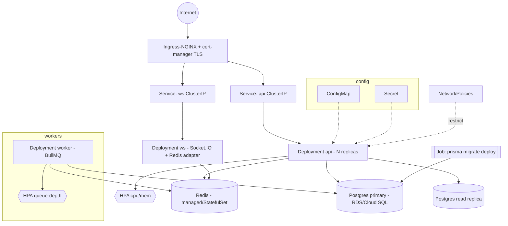
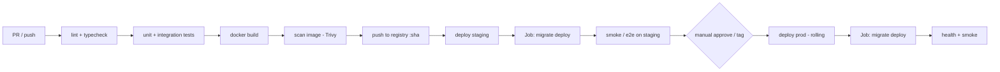

# 🚀 Life Quest — Production Deployment

> How Life Quest runs, from a laptop to a multi-region Kubernetes cluster. The actual
> Dockerfiles and k8s YAML live in [`infra/`](../infra) and [`backend/`](../backend); this
> doc is the operational contract they implement. Aligns with the
> [Roadmap scaling strategy](ROADMAP.md#8-future-scaling-strategy).

**Related:** [Roadmap](ROADMAP.md) · [Game Design](GAME_DESIGN.md) · [Wireframes](WIREFRAMES.md)

---

## 1. Environments & 12-Factor Config

| Env | Where | Purpose | Data |
|-----|-------|---------|------|
| **local** | `docker compose` on dev machine | development | disposable Postgres/Redis |
| **staging** | k8s namespace `life-quest-staging` | pre-prod, QA, migration rehearsal | anonymized/seeded |
| **production** | k8s namespace `life-quest-prod` (multi-AZ) | live | managed Postgres + Redis, backups |

**12-factor:** config comes **only** from environment variables — never committed. App is
stateless (state in Postgres/Redis/object storage); processes are disposable; logs go to
stdout; dev/prod parity via the same image promoted across envs.

| Var | Purpose |
|-----|---------|
| `DATABASE_URL` | Postgres (`schema.prisma` datasource) |
| `DATABASE_REPLICA_URL` | read replica (optional) |
| `REDIS_URL` | cache + BullMQ |
| `JWT_ACCESS_SECRET` / `JWT_REFRESH_SECRET` | token signing |
| `STRIPE_SECRET_KEY` / `STRIPE_WEBHOOK_SECRET` | billing |
| `APPLE_IAP_SHARED_SECRET` / `GOOGLE_PLAY_SA_JSON` | mobile IAP verification |
| `FIREBASE_SA_JSON` | FCM push |
| `AI_COACH_API_KEY` | LLM provider |
| `NODE_ENV`, `PORT`, `LOG_LEVEL`, `CORS_ORIGINS` | runtime |

Secrets are injected from a secret manager (Vault / cloud secrets → k8s `Secret`); a
`ConfigMap` holds non-secret config. `.env.example` documents every key.

---

## 2. Docker

### 2.1 Multi-stage backend Dockerfile (`backend/Dockerfile`)

A slim, cache-friendly, non-root production image:

```
Stage 1 "deps"    node:20-alpine → copy package*.json + prisma → npm ci → prisma generate
Stage 2 "build"   → copy source → npm run build (dist/) → npm prune --omit=dev
Stage 3 "runtime" node:20-alpine → copy node_modules, dist, prisma
                  → USER node (non-root) → EXPOSE 3000
                  → HEALTHCHECK curl /api/v1/health
                  → CMD ["node","dist/main.js"]
```

Notes: `prisma generate` in build so the client ships in the image; migrations run as a
**separate Job/initContainer** (§4), never in `CMD`; `.dockerignore` excludes tests, env,
node_modules; the image is the single artifact promoted local→staging→prod.

### 2.2 docker-compose (`infra/docker-compose.yml`)

Local one-command stack; services mirror the k8s topology so dev/prod parity holds.

| Service | Image | Role |
|---------|-------|------|
| `api` | built from `backend/Dockerfile` | NestJS REST + WS |
| `worker` | same image, `CMD` worker entry | BullMQ gamification/notification/PvP workers |
| `postgres` | `postgres:16-alpine` | database (named volume) |
| `redis` | `redis:7-alpine` | cache + queues |
| `nginx` | `nginx:alpine` | reverse proxy / TLS termination locally |

A one-shot `migrate` service runs `prisma migrate deploy` + seed before `api` starts
(depends_on with healthchecks). `docker compose up --build` = full local env (README Quick
Start).

---

## 3. Kubernetes (Production)

### 3.1 Topology



### 3.2 Manifests (in `infra/k8s/`)

| Manifest | Purpose |
|----------|---------|
| `namespace.yaml` | `life-quest-prod` / `-staging` isolation |
| `configmap.yaml` | non-secret config (log level, CORS, feature flags) |
| `secret.yaml` (sealed / from secret manager) | DB URL, JWT secrets, Stripe, FCM, IAP keys |
| `deployment-api.yaml` | NestJS API; readiness `/health/ready`, liveness `/health/live`; resource requests/limits; rolling strategy |
| `deployment-ws.yaml` | Socket.IO pods (guild chat/PvP live) w/ Redis adapter, session affinity |
| `deployment-worker.yaml` | BullMQ workers (gamification, notifications, PvP/mission finalize) |
| `service-api.yaml`, `service-ws.yaml` | ClusterIP services |
| `ingress.yaml` | Ingress-NGINX + cert-manager (Let's Encrypt TLS), path routing `/api`, `/socket.io` |
| `hpa-api.yaml`, `hpa-worker.yaml` | HPA: API on CPU/mem, worker on queue depth (KEDA/custom metric) |
| `postgres-statefulset.yaml` *or* managed RDS | prefer **managed Postgres** in prod; StatefulSet+PVC option for self-host/staging |
| `redis.yaml` | managed Redis or StatefulSet |
| `migrate-job.yaml` | `prisma migrate deploy` Job, run pre-cutover |
| `networkpolicy.yaml` | default-deny; allow api/worker→db/redis, ingress→api/ws only |
| `pdb.yaml` | PodDisruptionBudget (keep ≥ N api pods during drains) |
| `servicemonitor.yaml` | Prometheus scrape config |

**Recommendation:** use **managed Postgres (RDS/Cloud SQL)** in prod for backups, HA, and
replicas out of the box; reserve the StatefulSet for staging/self-hosted.

---

## 4. CI/CD (GitHub Actions)



- **Pipeline:** `lint → test → build → scan → push → deploy staging → migrate → e2e →
  (approval) → deploy prod → migrate → verify`.
- **Images** tagged by commit SHA (immutable) + `latest` on main; same image promoted
  staging→prod (no rebuild).
- **Migration strategy:** `prisma migrate deploy` runs as a **k8s Job (or initContainer)
  before app cutover**, never at container start. Migrations are **expand-then-contract**
  (backward-compatible) so old and new pods coexist during rollout — deploy additive
  schema first, backfill, then remove old columns in a later release.
- **Deploy:** `kubectl`/Helm/Argo; rolling update; automatic rollback on failed readiness.
- Secrets via GitHub OIDC → cloud, not long-lived keys.

---

## 5. Observability

| Concern | Tooling | Detail |
|---------|---------|--------|
| **Metrics** | Prometheus + Grafana | RED metrics (rate/errors/duration) per route; queue depth, job latency, DB pool, ledger write rate; business dashboards (activations, completions/min) |
| **Logs** | stdout → Loki/ELK | structured JSON (pino/nest-winston), request id + user id correlation |
| **Tracing** | OpenTelemetry → Tempo/Jaeger | trace quest-complete: API→queue→worker→DB |
| **Healthchecks** | NestJS Terminus | `/health/live` (process), `/health/ready` (DB+Redis reachable) → k8s liveness/readiness probes |
| **Alerting** | Alertmanager → Slack/PagerDuty | error-rate, p95 latency, queue backlog, DB replica lag, cert expiry |

---

## 6. Autoscaling & Zero-Downtime

- **HPA:** API scales on CPU/memory; workers scale on **BullMQ queue depth** (KEDA) so
  reward-processing spikes (e.g. evening quest rush) absorb elastically.
- **Rolling deploys:** `maxSurge=1, maxUnavailable=0`; new pods must pass readiness before
  old drain; `PodDisruptionBudget` protects quorum; `preStop` + `terminationGracePeriod`
  drain in-flight requests/WS connections.
- **Zero-downtime migrations:** expand-then-contract (§4) means schema changes never break
  the pods still serving old code.
- **Graceful WS:** Socket.IO clients auto-reconnect; sticky sessions + Redis adapter keep
  guild chat/PvP live across rollouts.

---

## 7. Backups, DR, Security

### Backups & DR
- Managed Postgres: automated daily snapshots + **PITR** (point-in-time recovery, WAL);
  cross-region snapshot copy.
- Redis is a **cache/queue** (rebuildable) — not the source of truth; durable jobs use
  Postgres-backed state where needed.
- **DR targets:** RPO ≤ 5 min (PITR), RTO ≤ 1 hr (restore + redeploy from image). Quarterly
  restore drills. Object storage (cosmetic/boss assets) versioned + replicated.

### Security hardening
- Non-root containers, read-only root FS where possible, dropped Linux capabilities.
- **NetworkPolicies:** default-deny; only ingress→api/ws and api/worker→db/redis allowed.
- TLS everywhere (ingress via cert-manager; DB connections TLS-required).
- Secrets from a manager (Vault/cloud), never in images or Git; rotate JWT/DB creds.
- Image scanning (Trivy) in CI; dependency audit; SBOM.
- App-level: JWT access+refresh with rotation & `RefreshToken` revocation, rate limiting,
  input validation, Stripe/IAP **webhook signature verification + idempotency**,
  `AuditLog` for sensitive actions, CORS allowlist, security headers via nginx.
- Least-privilege k8s RBAC + per-service ServiceAccounts.
- GDPR: data export + account deletion honored end-to-end (see Game Design §13 guardrails).
