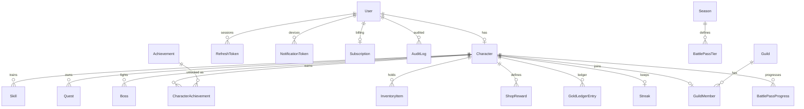
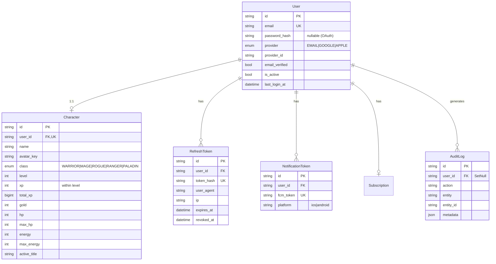
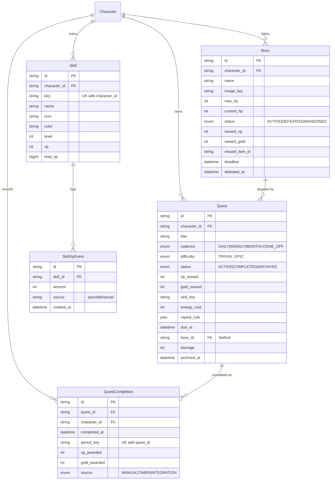
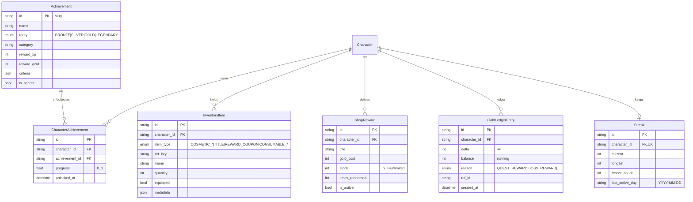
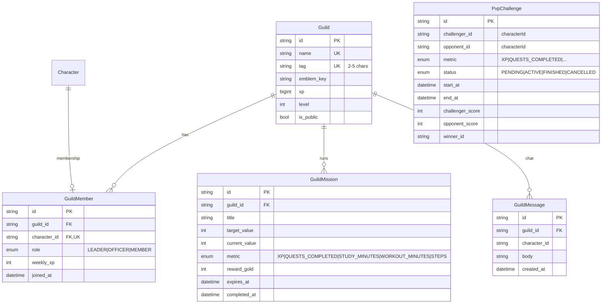
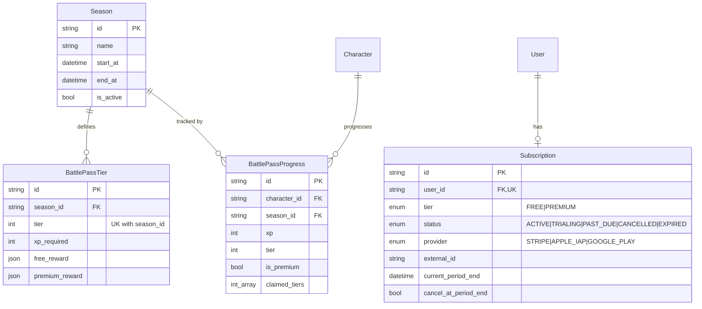

# Life Quest — Entity-Relationship Diagrams

> Mermaid `erDiagram` views generated from
> [`backend/prisma/schema.prisma`](../backend/prisma/schema.prisma).
> Split into logical groups for readability, plus a high-level overview.
>
> Cardinality notation: `||--o{` = one-to-many (optional many), `||--||` =
> one-to-one, `||--o|` = one-to-optional-one. Only key attributes are shown; see
> [DATABASE.md](DATABASE.md) for the full column list.

---

## 1. High-Level Overview

The `Character` is the hub; `User` is the identity root. Everything a player owns
hangs off `Character`.

---

## 2. Identity + Character

---

## 3. Quests + Bosses + Skills

> Idempotency: `QuestCompletion` carries a unique `(quest_id, period_key)` — one
> completion per quest per cadence period.

---

## 4. Achievements + Economy + Streaks

---

## 5. Social (Guilds + PvP)

> `PvpChallenge` references characters by id (`challenger_id`, `opponent_id`,
> `winner_id`) without hard FK relations in the schema — duels are resolved at the
> application layer.

---

## 6. Monetization (Battle Pass + Subscription)

> `BattlePassProgress` is unique per `(character_id, season_id)`;
> `BattlePassTier` is unique per `(season_id, tier)`.

---

## 7. Related Documents

- [DATABASE.md](DATABASE.md) — table-by-table reference
- [ARCHITECTURE.md](ARCHITECTURE.md) — bounded contexts & system design
