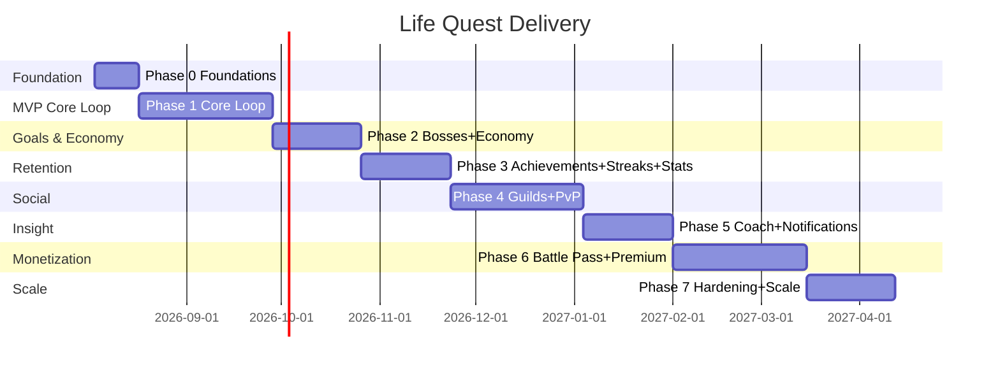
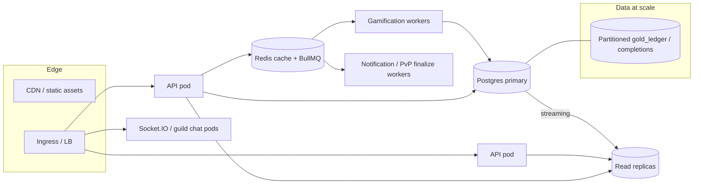

# 🗺️ Life Quest — Delivery Roadmap

> How every feature lands, phase by phase, sprint by sprint. Scope aligns with the
> [README Feature Map](../README.md), [Game Design Bible](GAME_DESIGN.md),
> [Wireframes](WIREFRAMES.md), and [`schema.prisma`](../backend/prisma/schema.prisma).

**Related:** [Game Design](GAME_DESIGN.md) · [Wireframes](WIREFRAMES.md) · [Deployment](DEPLOYMENT.md)

---

## 1. MVP Definition

The MVP proves the **core loop**: *do a real thing → complete a quest → gain XP/gold/skill
→ keep a streak → level up.* If that loop is delightful and retentive, everything else
compounds on top.

### In scope (MVP)

| Area | MVP slice |
|------|-----------|
| **Auth** | Email + Google + Apple sign-in, JWT access+refresh, verify email |
| **Character** | Creation (name, `CharacterClass`, avatar), level/XP/gold/HP/energy, level-up engine |
| **Quests** | Daily quests CRUD, complete (idempotent `periodKey`), difficulty scaling, energy cost |
| **Skills** | 8 seeded skills, skill XP on completion, per-skill levels, basic history |
| **Progression engine** | `xpForLevel` curve, difficulty multipliers, gold ledger, HP/energy growth |
| **Streaks** | Daily streak counting, milestone rewards, freeze consume logic |
| **Achievements (basic)** | Engine + ~30 seeded achievements (quests/skills/streaks families) |
| **Stats (basic)** | Quests done, current/longest streak, XP over time, skill split |
| **Infra** | Docker compose local, staging deploy, CI (lint/test/build), migrations |

### Explicitly OUT of MVP (later phases)

Bosses · Weekly/Monthly quests · Inventory/Shop · full Achievements (hundreds) · Guilds ·
PvP · AI Coach · Smart notifications (beyond basic reminders) · Battle Pass · Premium
subscription/paywall · advanced stats/exports · cosmetics library · health integrations.

**MVP success gate:** D1 ≥ 40%, D7 ≥ 20%, median 7-day streak among W1 actives ≥ 4 days.

---

## 2. Phased Roadmap

Durations assume the team in §4. Each phase ends shippable (staging → prod behind flags).

### Phase 0 — Foundations (2 wks)
- **Goals:** repo, CI/CD, schema migrated, auth skeleton, design system in Flutter.
- **Deliverables:** monorepo pipelines green; Postgres+Redis via compose; Prisma migrate
  deploy Job; NestJS bootstrap (health, config, logging); Flutter theme + nav shell +
  Riverpod/go_router/Dio wiring; staging env live.
- **Epics:** `EPIC-INFRA`, `EPIC-DESIGNSYS`, `EPIC-AUTH(skeleton)`.

### Phase 1 — Core Loop / MVP (6 wks)
- **Goals:** the full MVP loop (see §1).
- **Deliverables:** auth (email+OAuth+JWT refresh); character creation & card; daily
  quests CRUD+complete; skills + skill XP; gamification engine (XP/level/gold ledger);
  streaks + freezes; ~30 achievements; basic stats; smart quest reminders (basic).
- **Epics:** `EPIC-AUTH`, `EPIC-CHARACTER`, `EPIC-QUESTS`, `EPIC-SKILLS`,
  `EPIC-GAMIFICATION`, `EPIC-STREAKS`, `EPIC-ACH-BASIC`, `EPIC-STATS-BASIC`.

### Phase 2 — Bosses & Economy (4 wks)
- **Goals:** big goals + self-reward economy.
- **Deliverables:** Bosses (HP, linked-quest damage, defeat rewards, deadlines);
  Weekly/Monthly quest cadences + repeat rules; Inventory; Shop (user-defined
  `ShopReward` + cosmetics/consumables); gold sinks live.
- **Epics:** `EPIC-BOSSES`, `EPIC-QUESTS-CADENCE`, `EPIC-INVENTORY`, `EPIC-SHOP`.

### Phase 3 — Achievements, Streaks depth & Stats (4 wks)
- **Goals:** long-tail retention systems.
- **Deliverables:** tiered achievement families (→ hundreds); full streak milestone table;
  advanced statistics dashboard + heatmaps; cosmetics/titles library + equipping.
- **Epics:** `EPIC-ACH-FULL`, `EPIC-STATS-ADV`, `EPIC-COSMETICS`.

### Phase 4 — Social: Guilds & PvP (6 wks)
- **Goals:** social pull & competition.
- **Deliverables:** Guilds (membership, roles, chat via Socket.IO, missions, weekly
  leaderboard); PvP challenges (5 metrics, weekly cadence, scoring, anti-cheat).
- **Epics:** `EPIC-GUILDS`, `EPIC-GUILD-CHAT`, `EPIC-PVP`.

### Phase 5 — Insight: AI Coach & Notifications (4 wks)
- **Goals:** personalization & smart re-engagement.
- **Deliverables:** AI Coach (feature snapshot → LLM → personalized quests, weak-area,
  routines, prediction, burnout guardrail); smart notification engine (FCM, quiet hours,
  frequency caps).
- **Epics:** `EPIC-COACH`, `EPIC-NOTIFICATIONS`.

### Phase 6 — Monetization: Battle Pass & Premium (6 wks)
- **Goals:** revenue without dark patterns.
- **Deliverables:** Battle Pass (seasons, tiers, free/premium tracks, tier XP); Premium
  subscription (Stripe + Apple IAP + Google Play, webhooks, entitlements); paywall;
  feature gating.
- **Epics:** `EPIC-BATTLEPASS`, `EPIC-BILLING`, `EPIC-PAYWALL`.

### Phase 7 — Hardening & Scale (4 wks)
- **Goals:** production-grade reliability & scale (see §8).
- **Deliverables:** move gamification to workers, caching, read-replica reads, ledger
  partitioning, load tests, observability polish, DR drills, feature-flag maturity.
- **Epics:** `EPIC-SCALE`, `EPIC-OBSERVABILITY`, `EPIC-HARDENING`.

### 2.1 — 18 feature areas → phases

| # | Feature area (from README Feature Map) | Phase |
|--:|----------------------------------------|:-----:|
| 1 | Identity / Auth (Google/Apple/Email, JWT) | 0–1 |
| 2 | Character creation | 1 |
| 3 | Progression (XP, levels, Gold, Energy, HP) | 1 |
| 4 | Titles & cosmetics | 3 (titles), 3 (cosmetics lib) |
| 5 | Quests — Daily CRUD + complete | 1 |
| 6 | Quests — Weekly/Monthly + repeat rules | 2 |
| 7 | Skills (levels, XP, history) | 1 |
| 8 | Skills — heatmaps | 3 |
| 9 | Bosses | 2 |
| 10 | Achievements | 1 (basic) → 3 (full) |
| 11 | Economy — Inventory | 2 |
| 12 | Economy — Shop (self-rewards) | 2 |
| 13 | Streaks + freezes + milestones | 1 (basic) → 3 (full) |
| 14 | Social — Guilds (chat, missions, leaderboards) | 4 |
| 15 | Social — PvP challenges | 4 |
| 16 | Insight — Statistics dashboard | 1 (basic) → 3 (adv) |
| 17 | Insight — AI Coach + smart notifications | 5 |
| 18 | Monetization — Battle Pass + Premium subscription | 6 |

> All 18 areas map to a phase; retention systems (achievements, streaks, stats) ship a
> basic slice in MVP then deepen later.

---

## 3. Sprint Breakdown (first 4 sprints, 2-week)

Covers Phase 0 + Phase 1. Ticket IDs illustrative; `BE`=backend, `FE`=Flutter, `INF`=infra.

### Sprint 1 — Foundations (Phase 0)
| Ticket | Area | Description |
|--------|------|-------------|
| INF-1 | infra | Monorepo CI (lint/test/build) GitHub Actions |
| INF-2 | infra | docker-compose: api, postgres, redis; `.env.example` |
| INF-3 | infra | Prisma `migrate deploy` Job + seed script (skills, achievements) |
| INF-4 | infra | Staging cluster + ingress + TLS (see Deployment) |
| BE-1 | backend | NestJS bootstrap: config, health, logging, error model |
| FE-1 | mobile | Flutter shell: theme/design tokens, bottom nav, routing |
| FE-2 | mobile | Dio client + auth interceptor scaffolding + Hive cache |

### Sprint 2 — Auth & Character
| Ticket | Area | Description |
|--------|------|-------------|
| BE-2 | auth | Email signup/login, password hash, `RefreshToken`, JWT access+refresh |
| BE-3 | auth | Google + Apple OAuth; `AuthProvider`/`providerId`; email verify |
| BE-4 | character | Create character (class, avatar); seed 8 `Skill` rows |
| FE-3 | auth | Onboarding slides + auth screens (OAuth + email) |
| FE-4 | character | Character creation flow (name/class/avatar/focus skills) |
| BE-5 | platform | AuditLog + rate limiting + request validation |

### Sprint 3 — Quests & Gamification Engine
| Ticket | Area | Description |
|--------|------|-------------|
| BE-6 | quests | Daily Quest CRUD (title, difficulty, skillKey, rewards, energyCost) |
| BE-7 | quests | Complete quest: idempotent `periodKey`, `QuestCompletion` |
| BE-8 | gamification | Difficulty×cadence scaling; XP/level engine (`xpForLevel`) |
| BE-9 | gamification | Gold ledger (double-entry) + skill XP + `SkillXpEvent` |
| BE-10 | character | HP/energy growth on level-up; energy cost on completion |
| FE-5 | home | Home dashboard: character card (level/XP/HP/energy/gold) |
| FE-6 | quests | Quest list + create/edit sheet + complete animation/haptic |

### Sprint 4 — Skills, Streaks, Achievements, Stats (MVP close)
| Ticket | Area | Description |
|--------|------|-------------|
| BE-11 | skills | Per-skill leveling curve; skill XP rollup; history endpoint |
| BE-12 | streaks | Streak count (tz `periodKey`), milestone rewards, freeze consume |
| BE-13 | achievements | Engine + seed ~30 (quests/skills/streaks families); event eval |
| BE-14 | stats | Basic stats aggregates endpoint |
| FE-7 | skills | Skills screen (bars) + basic history |
| FE-8 | streaks | Streak indicator + milestone celebration |
| FE-9 | achievements | Achievements gallery (basic) + unlock toast |
| FE-10 | stats | Basic stats dashboard |
| QA-1 | quality | E2E: onboarding→first completion→level up→streak; MVP hardening |

---

## 4. Team, RACI & Estimation

### Suggested team (7–8)
Tech Lead · 2 Backend (NestJS) · 2 Mobile (Flutter) · 1 DevOps/SRE · 1 Product/UX
(you) · fractional Game Designer + QA.

### RACI (R=Responsible, A=Accountable, C=Consulted, I=Informed)

| Activity | PM/UX | Tech Lead | Backend | Mobile | DevOps | Game Design |
|----------|:----:|:---------:|:-------:|:------:|:------:|:-----------:|
| Requirements & scope | A/R | C | I | I | I | C |
| Economy/curve tuning | C | C | R | I | I | A/R |
| API/schema | I | A | R | C | I | C |
| Mobile UX build | A | C | I | R | I | I |
| Infra / CI-CD / deploy | I | C | I | I | A/R | I |
| Release & QA sign-off | A | R | C | C | C | I |
| Live-ops / seasons | A/R | C | C | I | I | R |

### Estimation
Story points (Fibonacci), velocity-based. Assume ~40 pts/sprint at full team. Full
Phase 0–6 ≈ 9–10 months for a v1.0 public launch; Phase 7 continuous. MVP (Phase 0–1)
≈ **8 weeks / 4 sprints**.

---

## 5. Risk Register

| Risk | Impact | Likelihood | Mitigation |
|------|:------:|:----------:|------------|
| Economy imbalance (inflation / grind) | High | Med | Difficulty caps on gold, ledger analytics, tunable config, closed self-reward sink (GD §5) |
| "Addictive but healthy" slips into dark patterns | High | Med | Guardrail checklist (GD §13) gates every feature review; north-star = life improvement |
| Streak anxiety / churn on break | Med | Med | Freezes, forgiving copy, comeback rewards |
| AI Coach cost / bad advice | Med | Med | Aggregate-only input, deterministic caps wrapping LLM, cache, premium-gated deep calls |
| Cheating in PvP/leaderboards | Med | High | Anti-cheat matrix (GD §10.3): signed health data, velocity flags, rate limits |
| Cross-platform IAP complexity (Stripe/Apple/Google) | High | High | Isolate billing behind entitlement service; webhook idempotency; start Stripe-first |
| Flutter perf on low-end devices | Med | Med | Budget animations, lazy lists, respect Reduce Motion, device-lab testing |
| Scope creep across 18 areas | High | High | Strict MVP gate; phase flags; nothing ships without a flag |
| DB hotspots (ledger/completions at scale) | High | Low→Med | Partitioning + read replicas + workers (Phase 7 / §8) |
| Data privacy / GDPR | High | Low | Data export + delete, data minimalism, opt-in health sync |

---

## 6. KPIs / Success Metrics

| Metric | Definition | Target (v1) |
|--------|------------|-------------|
| **Activation** | Onboard → create character → complete 1st quest, day 0 | ≥ 65% |
| **D1 retention** | return next day | ≥ 40% |
| **D7 retention** | return day 7 | ≥ 20% |
| **D30 retention** | return day 30 | ≥ 10% |
| **Median streak** | median current streak of W1 actives | ≥ 4 days |
| **Quests/active/day** | completions per DAU | 3–5 |
| **Boss engagement** | % actives with ≥1 active boss (post-P2) | ≥ 35% |
| **Social attach** | % actives in a guild (post-P4) | ≥ 25% |
| **Premium conversion** | free → premium within 30d (post-P6) | 3–5% |
| **Healthy-engagement** | % sessions ending on a positive/rest nudge; low-energy override respected | monitored, not maximized |

---

## 7. Live-ops (post-launch, continuous)
Seasonal Battle Passes (~8–10 wks), rotating cosmetics, new achievement families, guild
events, PvP ladders, A/B tests on onboarding & curve tuning — all behind feature flags.

---

## 8. Future Scaling Strategy

Designed for growth from thousands → millions of users. Triggered in Phase 7 and evolved
continuously.

| Lever | Strategy |
|-------|----------|
| **Read replicas** | Route heavy reads (stats, leaderboards, gallery) to Postgres read replicas; writes to primary. Prisma read/write split. |
| **Partitioning** | Time-partition high-write tables `gold_ledger_entries`, `quest_completions`, `skill_xp_events` (monthly range partitions on `created_at`); hash-partition by `characterId` for very large tenants. Cheap pruning + hot/cold storage. |
| **Caching** | Redis for character card, skill/level lookups, leaderboards (sorted sets), achievement catalog, session/JWT denylist; cache-aside with TTL + event invalidation. |
| **Gamification to workers** | Move XP/level/ledger/achievement evaluation to BullMQ workers so quest-complete returns fast; the API enqueues, workers apply transactionally. Absorbs spikes, isolates CPU. |
| **Guild chat sharding** | Socket.IO with Redis adapter; shard chat pods by `guildId` (consistent hashing); persist async; separate WS deployment from REST API for independent scaling. |
| **Notifications/PvP** | Dedicated workers for FCM fan-out and scheduled PvP/mission finalization (cron/queue), decoupled from request path. |
| **Multi-region** | Region-pinned reads via replicas; primary in one region initially; later active-passive with async replication + regional CDN. Pin users by tz/region. |
| **Feature flags** | Every phase feature flag-gated (e.g. Unleash/config-service) for gradual rollout, kill-switches, and A/B tests. |
| **Cost control** | HPA on CPU/queue depth; scale workers to zero off-peak; managed Postgres (RDS/Cloud SQL) with autoscaling storage; Redis right-sized; cache LLM Coach calls + premium-gate to cap AI spend; CDN offloads static/cosmetic assets. |

**Scaling milestones:** ≤10k users → single primary + Redis + workers (Phase 7 baseline).
≤100k → read replicas + partition ledger/completions + WS split. ≥1M → multi-region reads,
hash-partitioned per-tenant, dedicated leaderboard/chat services.
