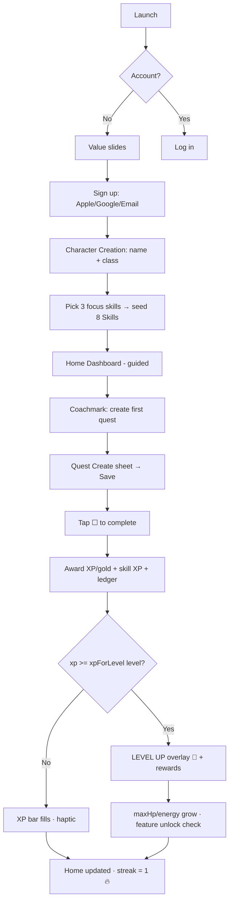
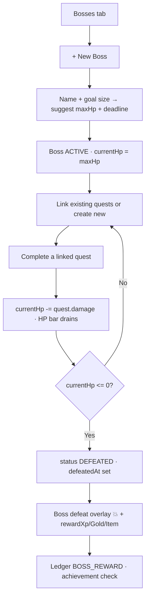
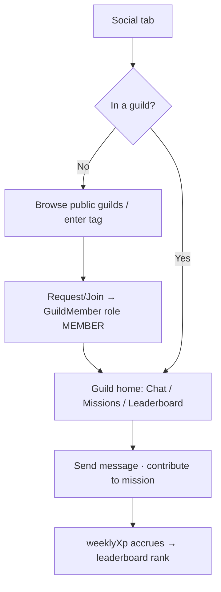

# 🎨 Life Quest — Wireframes & UX Flows

> Screen-by-screen wireframes, navigation, and user flows. Content aligns with the
> [Game Design Bible](GAME_DESIGN.md) and [`schema.prisma`](../backend/prisma/schema.prisma).
> Wireframes are **low-fidelity intent**, not pixel specs — they define layout, hierarchy,
> and behavior for the Flutter build.

**Related:** [Game Design](GAME_DESIGN.md) · [Roadmap](ROADMAP.md) · [Deployment](DEPLOYMENT.md)

---

## 1. Design Language

Premium and calm — the feel of **Apple** (restraint, depth), **Duolingo** (delightful,
motivating), and **Notion** (clean information density).

### Palette — dark-first

| Token | Dark | Light | Use |
|-------|------|-------|-----|
| `bg/base` | `#0E0E14` | `#F7F7FB` | app background |
| `bg/surface` | `#17171F` | `#FFFFFF` | cards |
| `bg/elevated` | `#1F1F2A` | `#F0F0F6` | sheets, popovers |
| `text/primary` | `#F5F5FA` | `#12121A` | headings/body |
| `text/muted` | `#9A9AB0` | `#6A6A80` | secondary |
| `accent/primary` | `#7C5CFF` | `#7C5CFF` | brand (matches `Skill.color` default) |
| `accent/xp` | `#4CC2FF` | — | XP / level bars |
| `accent/hp` | `#FF5C7A` | — | HP bar |
| `accent/energy` | `#3DE0A0` | — | energy bar |
| `accent/gold` | `#FFC24C` | — | gold |
| rarity | bronze `#CD7F32` · silver `#C0C0C0` · gold `#FFD700` · legendary `#B14CFF` | | achievements/items |

### Typography, spacing, motion, haptics

- **Type:** Display "SF Pro Rounded" / "Lexend" (friendly geometric); mono "JetBrains
  Mono" for numbers (XP/gold tabular). Scale: 34/28/22/17/15/13.
- **Spacing:** 4-pt grid; 16 default gutter; 20-radius cards, 28-radius sheets; generous
  whitespace over density.
- **Motion:** 200–300 ms `easeOutCubic` transitions; springy scale on tap (0.97). Bars
  animate value changes (XP fill, HP drain on boss hit). Confetti/particle bursts reserved
  for level-up & boss defeat only.
- **Haptics:** light impact on quest check; success notification on level-up; heavy impact
  on boss defeat; selection tick on tab change.
- **Elevation:** soft, low-opacity shadows + subtle inner-glow on accent elements; no
  skeuomorphism.

---

## 2. Primary Navigation

Bottom tab bar, 5 destinations. Center = daily hub. Icons filled when active, accent tint.

```
┌──────────────────────────────────────────────────────────┐
│                     ( screen content )                    │
│                                                            │
├──────────────────────────────────────────────────────────┤
│   🏠        📊        🐉        🛡️        👤              │
│  Home     Skills    Bosses   Social   Profile             │
│ (Quests)                                                   │
└──────────────────────────────────────────────────────────┘
```

| Tab | Screen | Key content |
|-----|--------|-------------|
| 🏠 Home | Dashboard | character card, today's quests, streak |
| 📊 Skills | Skills | 8 skill bars + heatmap |
| 🐉 Bosses | Bosses | active goals as HP bars |
| 🛡️ Social | Guild + PvP | chat, missions, leaderboard, duels |
| 👤 Profile | Profile hub | achievements, inventory, shop, stats, coach, battle pass, settings |

---

## 3. Screen Wireframes

### 3.1 Onboarding + Auth

```
┌───────────────────────────┐   ┌───────────────────────────┐
│                           │   │        Welcome back        │
│        ⚔️ LIFE QUEST      │   │                           │
│   Turn your life into     │   │  Email  [______________]  │
│        an RPG             │   │  Pass   [______________]  │
│                           │   │       [   Log in   ]      │
│   ● ○ ○   (3 value slides)│   │  ─────── or ───────       │
│                           │   │   Continue with Google    │
│  [ Continue with Apple ]  │   │   Continue with Apple     │
│  [ Continue with Google ] │   │                           │
│  [ Sign up with Email   ] │   │  Forgot password?         │
│   Already have an account?│   └───────────────────────────┘
└───────────────────────────┘   AuthProvider: EMAIL|GOOGLE|APPLE
```
3 value slides (habits→quests, goals→bosses, consistency→XP), then auth. OAuth is
one-tap; email adds a verify step (`User.emailVerified`).

### 3.2 Character Creation

```
┌───────────────────────────────────────┐
│  Create your character           1 / 2 │
│                                        │
│  Name  [ Azat________________ ]        │
│                                        │
│  Choose your class                     │
│  ┌────────┐ ┌────────┐ ┌────────┐      │
│  │⚔️ WARRIOR│ │🔮 MAGE │ │🗡️ ROGUE│     │
│  │discipline│ │knowledge│ │finance │    │
│  └────────┘ └────────┘ └────────┘      │
│  ┌────────┐ ┌────────┐                 │
│  │🏹 RANGER│ │🛡️PALADIN│  (RANGER =    │
│  │balance ● │ │leadership│  default)    │
│  └────────┘ └────────┘                 │
│                                        │
│  Pick your avatar   ◐ ◑ ◒ ◓           │
│                     [   Next   ]       │
└───────────────────────────────────────┘
Step 2: pick 3 focus skills → seeds Skill rows → [ Begin ]
```
`CharacterClass` enum drives flavor + starter skill emphasis. Choosing focus skills seeds
the 8 `Skill` rows (highlighting 3).

### 3.3 Home Dashboard

```
┌───────────────────────────────────────────────┐
│ Azat · RANGER              🔥 12   ⚙️           │  ← streak, settings
│ ┌───────────────────────────────────────────┐ │
│ │  ◓  Lv 7  "Initiate"                       │ │  CHARACTER CARD
│ │     XP  ▓▓▓▓▓▓▓░░░  1,120 / 1,852          │ │  level, xp/xpForLevel(7)
│ │     HP  ▓▓▓▓▓▓▓▓▓░  92/160                 │ │  hp/maxHp
│ │     EN  ▓▓▓▓▓░░░░░  55/115                 │ │  energy/maxEnergy
│ │     🪙 1,340 gold                          │ │  gold
│ └───────────────────────────────────────────┘ │
│                                                │
│  Today · Fri Jul 25         3 of 5 done  ✓60% │
│  ┌───────────────────────────────────────────┐│
│  │ ☐  Morning run        HARD  💪 +35xp ⚡15  ││  quest row:
│  │ ☑  Read 20 pages      EASY  📖 +15xp      ││  check, difficulty,
│  │ ☐  Deep work 2h       EPIC  💻 +60xp ⚡20  ││  skill, xp, energy
│  │ ☑  Meditate           TRIVIAL ✓           ││
│  │ ☐  Budget review      MEDIUM 💰 +20xp     ││
│  └───────────────────────────────────────────┘│
│                              [ + New Quest ]   │
│  ⚡ Low energy — 1 more quest, then rest 🌙     │  ← healthy nudge
└───────────────────────────────────────────────┘
```
Tapping ☐ → check animation + haptic + XP bar fill; may trigger level-up overlay (§5).

### 3.4 Quest Create / Edit Sheet

```
┌───────────────────────────────────────┐  (bottom sheet)
│ ══                          New Quest  │
│ Title       [ Morning run__________ ]  │
│ Notes       [ 5km easy pace________ ]  │
│                                        │
│ Cadence   ( Daily ) Weekly Monthly One │  QuestCadence
│ Repeat    M T W T F S S  → [M,W,F]     │  repeatRule JSON
│ Difficulty ○Trivial ○Easy ●Medium      │  Difficulty
│            ○Hard ○Epic                 │
│                                        │
│ Skill      [ 💪 fitness        ▼ ]     │  skillKey
│ Link boss  [ 🐉 Run a 10K      ▼ ]     │  bossId (optional)
│                                        │
│ Rewards (auto)  +35 XP  🪙15  ⚡15  ⚔20 │  scaled preview (§GD 3/6)
│ Due at     [ 07:00 ]                    │  dueAt
│              [   Save quest   ]         │
└───────────────────────────────────────┘
```
Reward preview recomputes live from difficulty × cadence (Game Design §3). Linking a boss
reveals the `damage` value.

### 3.5 Skills

```
┌───────────────────────────────────────────────┐
│  Skills                                        │
│  💻 Programming  Lv 9  ▓▓▓▓▓▓░░ 820/1,350      │
│  💪 Fitness      Lv 6  ▓▓▓▓░░░░ 300/734        │
│  📖 Reading      Lv 8  ▓▓▓▓▓▓▓░ 900/1,131      │
│  🗣️ English      Lv 4  ▓▓▓░░░░░ 150/400        │
│  💼 Business     Lv 3  ▓▓░░░░░░  60/259        │
│  💰 Finance      Lv 2  ▓░░░░░░░  40/141        │
│  👑 Leadership   Lv 3  ▓▓▓░░░░░ 120/259        │
│  🧘 Discipline   Lv 7  ▓▓▓▓▓░░░ 600/926        │
│  ─────────────────────────────────────────────│
│  Consistency (last 12 weeks)                   │
│   M ░▓▓█░▓░  ▓▓█▓░░▓  ░▓▓▓█░▓ ...  ← heatmap   │
│   Tap a skill → its own heatmap + history      │
└───────────────────────────────────────────────┘
```
Bars use each `Skill.color`. Heatmap from `SkillXpEvent` (Game Design §4.3).

### 3.6 Boss Detail

```
┌───────────────────────────────────────────────┐
│  ←            🐉  Run a 10K                     │
│         ┌─────────────────────┐                │
│         │   (boss artwork)    │                │  imageKey
│         └─────────────────────┘                │
│   HP  ▓▓▓▓▓▓▓▓▓▓▓▓░░░░░░░░  480 / 750           │  currentHp/maxHp
│   Deadline: Aug 20 (26 days)     status ACTIVE │
│   Reward on defeat:  +750 XP  🪙375  🎁 frame   │  rewardXp/Gold/Item
│  ─────────────────────────────────────────────│
│  Linked quests (deal damage)                   │
│  ☐ Morning run     ⚔ 20   ☐ Interval training ⚔30│
│  ☐ Long run Sun    ⚔ 40                         │
│  Completing them chips the HP bar ↑             │
│              [ + Link a quest ]                 │
│  ⋯ Reschedule   ⋯ Abandon (no penalty)          │
└───────────────────────────────────────────────┘
```
Completing a linked quest animates HP drain + "-20" damage number. At 0 HP → defeat
overlay (§5).

### 3.7 Achievements Gallery

```
┌───────────────────────────────────────────────┐
│  Achievements            87 / 214 unlocked  41%│
│  [ All ][Quests][Skills][Streaks][Social][Eco] │  category filter
│  ┌────┐ ┌────┐ ┌────┐ ┌────┐                   │
│  │🥇  │ │🥈  │ │🔒  │ │🥉  │                   │  rarity-framed tiles
│  │Grand│ │On   │ │????│ │First│                  │
│  │master│ │Fire │ │secret│ │Blood│               │
│  └────┘ └────┘ └────┘ └────┘                   │
│  ┌────┐ ┌────┐ ┌────┐ ┌────┐                   │
│  │🟣  │ │🥈  │ │🥉  │ │🥇  │                   │
│  │Mythic│ │Saver│ │Payday│ │Centurion│           │
│  │▓▓░ 500/1000│ ...  (progress on tiered)        │
│  └────┘ └────┘ └────┘ └────┘                   │
└───────────────────────────────────────────────┘
```
Tile shows `Rarity` frame + progress ring (`CharacterAchievement.progress`). Locked
secrets show `????`. Tap → detail with criteria + reward.

### 3.8 Inventory

```
┌───────────────────────────────────────────────┐
│  Inventory                                     │
│  [Avatars][Themes][Frames][Titles][Consumables]│  ItemType filter
│  ┌────┐ ┌────┐ ┌────┐                          │
│  │◓ ✓ │ │◑   │ │◒   │  ← ✓ = equipped          │
│  └────┘ └────┘ └────┘                          │
│  Consumables:                                  │
│   ❄️ Streak Freeze ×3     [ Use ]              │
│   ⚡ Energy Potion  ×2     [ Use ]              │
│  Titles:  "Initiate" ✓  ·  "Adept" (locked L10)│
└───────────────────────────────────────────────┘
```
Equipping a cosmetic sets `InventoryItem.equipped`; titles set `Character.activeTitle`.

### 3.9 Shop

```
┌───────────────────────────────────────────────┐
│  Shop                       🪙 1,340            │
│  My real-life rewards          [ + Add reward ]│
│  ┌───────────────────────────────────────────┐│
│  │ 🎮 1h gaming            60 🪙   [ Redeem ] ││  ShopReward
│  │ 🍕 Cheat meal          120 🪙   [ Redeem ] ││  goldCost
│  │ 🎬 Movie night          90 🪙   [ Redeem ] ││
│  │ 😴 Sleep in (stock 1)  200 🪙   [ Redeem ] ││  stock
│  └───────────────────────────────────────────┘│
│  ─── Cosmetics & consumables ───              │
│  ❄️ Streak Freeze  40 🪙   ⚡ Energy Potion 30🪙 │
│  🎨 Theme "Aurora" 300 🪙                       │
└───────────────────────────────────────────────┘
```
Redeem debits gold via `GoldLedgerEntry` (`SHOP_PURCHASE`), increments `timesRedeemed`,
decrements `stock`.

### 3.10 Guild (Social tab)

```
┌───────────────────────────────────────────────┐
│  [ Chat ] Missions  Leaderboard    ⚔️ PvP →    │
│  🛡️ [DSW] Dolphin Squad · Lv 4                 │
│ ┌───────────────────────────────────────────┐ │
│ │ Maya:  crushed my run streak today 🔥      │ │  GuildMessage
│ │ Ken:   nice! mission at 80%                │ │
│ │ You:   deep work done ✅                    │ │
│ └───────────────────────────────────────────┘ │
│  [ message… ___________________ ]  send        │
│ ── Missions tab ──                            │
│  🎯 Collective 5,000 XP  ▓▓▓▓▓▓▓░ 4,000/5,000 │  GuildMission
│     reward 🪙500 · ends in 2d                  │
│ ── Leaderboard tab ──                         │
│  1. Maya   2,310 wkXP   2. You 1,980 …         │  GuildMember.weeklyXp
└───────────────────────────────────────────────┘
```

### 3.11 PvP

```
┌───────────────────────────────────────────────┐
│  ←  PvP Duels                    Wins 12 · L3+ │
│  Active                                        │
│  ┌───────────────────────────────────────────┐│
│  │ You  1,980  vs  1,240  Ken    metric: XP  ││  PvpChallenge
│  │ ▓▓▓▓▓▓▓▓░░  ends Sun 23:59   ACTIVE       ││  scores, endAt
│  └───────────────────────────────────────────┘│
│  [ + Challenge ]  choose opponent + metric:    │
│   ●XP ○Quests ○Study min ○Workout min ○Steps   │  PvpMetric (5)
│  Pending invites (2)   ·   History             │
└───────────────────────────────────────────────┘
```

### 3.12 Statistics Dashboard

```
┌───────────────────────────────────────────────┐
│  Statistics                    [ 30d ][ 90d ]  │
│  Quests done 128 · Perfect days 22 · Best 🔥30 │
│  XP over time   ╱╲___╱▔╲__╱▔  ← line chart      │
│  Skill split    ▓▓▓ prog ▓▓ fit ▓ read …        │  donut
│  Activity heatmap  ░▓█▓░░▓ …                     │
│  Energy trend   ▔╲__╱▔╲   ⚠️ dips = burnout risk │
│  ⭐ Premium: exports, trends, predictions        │
└───────────────────────────────────────────────┘
```

### 3.13 AI Coach

```
┌───────────────────────────────────────────────┐
│  🤖 Coach                                      │
│  ┌───────────────────────────────────────────┐│
│  │ Your finance skill hasn't moved in 3 weeks.││  weak-area
│  │ Try a small daily money quest?             ││
│  │   [ Add "Track spending" quest ]           ││  → prefilled sheet
│  └───────────────────────────────────────────┘│
│  ┌───────────────────────────────────────────┐│
│  │ You complete 78% of quests before noon.    ││  routine insight
│  │ Suggested morning routine →  [ Preview ]   ││
│  └───────────────────────────────────────────┘│
│  ⭐ Prediction (L20+):  Lv 20 by Sep 14         │  long-term
│     "Marathon" boss on track — defeat ~Aug 22  │
│  ⚡ You've been low-energy 4 days. Rest today?  │  burnout guardrail
└───────────────────────────────────────────────┘
```

### 3.14 Battle Pass

```
┌───────────────────────────────────────────────┐
│  Season 2 · "Ember"        ends in 34 days     │
│  Tier 14 / 50   ▓▓▓▓▓░ 340/1,150 to tier 15    │  BattlePassProgress
│  ┌── Premium ──┐ ┌── Premium ──┐ ┌── Prem ──┐  │  premiumReward
│  │ 🎨 frame ✓  │ │ ⚡ potion ✓ │ │ 🔒 avatar │  │
│  ├── Free ─────┤ ├── Free ─────┤ ├── Free ───┤  │  freeReward
│  │ 🪙 100 ✓    │ │ ❄️ freeze ✓ │ │ 🪙 150    │  │
│  │  T13        │ │  T14 ●      │ │  T15      │  │
│  └─────────────┘ └─────────────┘ └───────────┘  │
│  [ Unlock Premium track — included w/ Premium ] │
└───────────────────────────────────────────────┘
```

### 3.15 Paywall / Premium

```
┌───────────────────────────────────────────────┐
│  ✕                                             │
│        ⭐ Life Quest Premium                    │
│   Go deeper. Never pay-to-win.                 │
│   ✓ Full AI Coach & predictions                │
│   ✓ Advanced stats + exports                   │
│   ✓ Premium Battle Pass track                  │
│   ✓ Unlimited bosses, full cosmetics           │
│  ┌─────────────┐  ┌─────────────┐              │
│  │  Monthly    │  │  Annual  ⭐  │              │
│  │  $6.99/mo   │  │ $49.99/yr   │  −40%        │
│  │             │  │ 7-day trial │              │
│  └─────────────┘  └─────────────┘              │
│        [ Start free trial ]                    │
│   Cancel anytime · Restore purchases           │
└───────────────────────────────────────────────┘
```
Honest copy, no confirm-shaming (Game Design §13). `BillingProvider` chosen by platform.

### 3.16 Settings

```
┌───────────────────────────────────────────────┐
│  Settings                                      │
│  Account       azalinyan@… · Google · verified │
│  Notifications  Quest reminders   [on]         │
│                 Streak alerts      [on]         │
│                 Guild/PvP          [on]         │
│  Appearance     Theme  [ Dark ▾ ]  Haptics [on]│
│  Timezone       (for streaks/periodKey)        │
│  Health sync    Apple Health / Google Fit [off]│
│  Subscription   Premium · renews Aug 20  Manage│
│  Privacy        Export my data · Delete account│
│  About          v1.0.0 · Terms · Support       │
└───────────────────────────────────────────────┘
```

---

## 4. Key User Flows

### 4.1 Onboarding → first completion → level up



### 4.2 Create boss → link quests → defeat



### 4.3 Join a guild



---

## 5. Empty / Error / Notifications / Micro-interactions

### Empty states (encouraging, never blank)

| Screen | Copy | CTA |
|--------|------|-----|
| Home, no quests | "Your quest log is empty. Every hero starts with one small step." | + Create your first quest |
| Bosses | "No bosses yet. Turn a big goal into a beatable boss." | + New Boss |
| Achievements | "214 achievements await. Complete a quest to earn your first." | Go to quests |
| Guild | "Adventures are better together." | Find a guild |
| Skills heatmap | "Complete quests to light up your consistency map." | — |

### Error states

| Case | Behavior |
|------|----------|
| Offline | Optimistic UI; queue completions locally (Hive), sync on reconnect; "Offline — saved, will sync" banner |
| Not enough energy | Soft block: "Low energy — one more, then rest 🌙"; never a hard paywall |
| Not enough gold (shop) | Disabled Redeem + "Earn 60 more gold" hint |
| Sync conflict | Idempotent `periodKey` — server wins, no double award; silent reconcile |
| Auth expired | Silent refresh via `RefreshToken`; only prompt login if refresh fails |
| Server 5xx | Friendly "Something went wrong" + retry; nothing lost |

### Notification examples (respect Settings, no spam)

- 🔥 "Day 12 streak — keep it alive! 3 quests left today." (once, evening, if incomplete)
- 🐉 "Only 120 HP left on *Run a 10K* — finish it this week!"
- 🎉 "New achievement: On Fire (7-day streak)! +100 XP"
- ⚔️ "Ken challenged you to a PvP duel: most XP this week."
- ⭐ Weekly (free) Coach tip Sunday morning.
> Frequency-capped; quiet hours honored; never guilt-based (Game Design §13).

### Micro-interactions

- **Quest check:** row collapses with a satisfying tick, XP counter rolls up, light haptic.
- **Level-up:** full-screen dim + character portrait scales up, particle burst, "LEVEL 8!"
  with new unlocks listed, success haptic; dismiss on tap.
- **Boss defeat:** screen shake, HP bar shatters, boss artwork cracks, coins fountain,
  heavy haptic, reward card slides up.
- **Streak freeze used:** gentle snowflake shimmer + reassuring copy.
- **Gold earned:** small coin bounce near the gold counter.

---

## 6. Accessibility

- **Contrast:** all text ≥ WCAG AA (4.5:1); accent-on-surface pairs verified in both themes.
- **Color independence:** difficulty/rarity/skill also use icons + labels, never color
  alone (color-blind safe). HP/energy/XP bars carry numeric labels.
- **Dynamic Type:** respect OS text scaling up to 200%; layouts reflow, no clipping.
- **Screen readers:** every control has a semantic label; bars announce "HP 92 of 160";
  quest rows announce difficulty + reward; live regions for level-up.
- **Motion:** honor "Reduce Motion" — swap particle celebrations for a simple fade + badge.
- **Touch targets:** ≥ 44×44 pt; primary actions reachable one-handed (bottom-anchored).
- **Haptics:** fully optional (Settings toggle).
- **Localization-ready:** all strings externalized; RTL-aware layouts.
